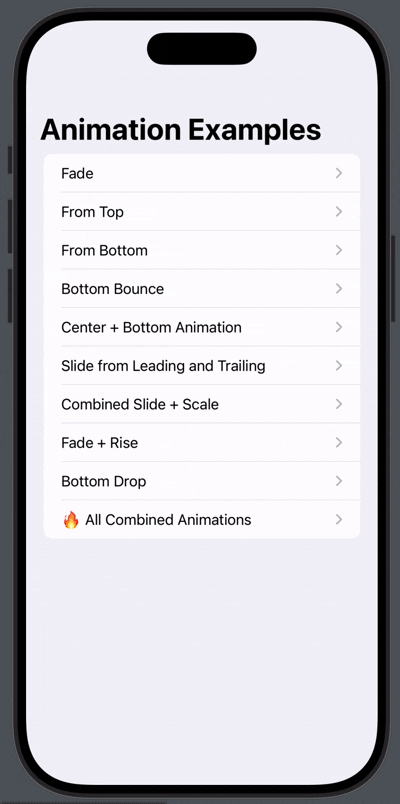
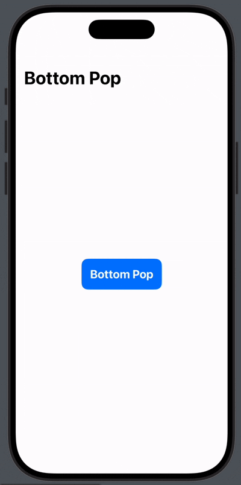
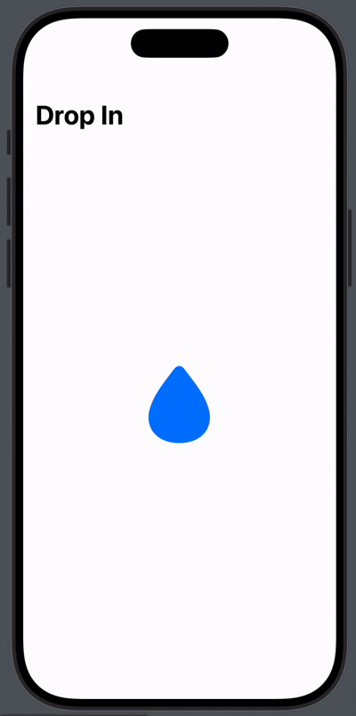

# Stateless AppearAnimation

A versatile SwiftUI animation utility that enables easy, reusable, and customizable appearance animations for any view in your SwiftUI projects.

---

## Table of Contents

- [Overview](#overview)  
- [Features](#features)  
- [Animations Explained](#animations-explained)  
- [Usage](#usage)  
- [Stateless Single-Line Animations](#stateless-single-line-animations)  
- [Improved Performance](#improved-performance)

---

## Overview

`AppearAnimation` is a SwiftUI animation utility designed to bring smooth, engaging, and customizable entrance animations to your app with minimal effort. The library abstracts common animation patterns like fade-ins, slides from various edges, scaling effects, bouncing, and combined animations, allowing you to create dynamic UI interactions effortlessly.

By simply applying a single modifier to a SwiftUI view, you can easily control how the view appears on the screen, with full customization over the animation’s timing, delay, easing curves, and other parameters. The flexibility of the modifier allows you to create various animation effects such as:

- **Fading** views in and out
- **Sliding** views from different edges (top, bottom, left, right)
- **Scaling** views from a particular size
- **Bouncing** and **popping** effects for lively interactions
- **Combined animations** for more complex transitions

Additionally, the library features a **tap scaling effect**, providing instant visual feedback on user interaction (perfect for buttons or interactive components). For precise UI control, you also have the option to apply custom X/Y offsets to fine-tune the positioning of your views.

---

## Features

- **Multiple animation styles**:  
  Includes fade, scale, slide, bounce, pop, combined effects, and more. These animations can be customized with delays, durations, and easing curves for more control over the effect.

- **Directional entrances**:  
  Animate views coming in from any of the four edges—top, bottom, left, or right. This is ideal for creating seamless transitions between views or UI elements.

- **Customizable animation properties**:  
  Full control over timing, duration, delays, and easing curves, allowing you to fine-tune the animations to suit your design requirements.

- **Tap scale feedback**:  
  Add visual feedback when the user taps on interactive views like buttons or icons. The view scales down and up briefly, providing instant interaction feedback.

- **Flexible offset positioning**:  
  Apply custom offsets to position your views precisely within the layout. Adjust for X and Y axis with a clean, easy-to-read syntax.

- **Clean and easy-to-use API**:  
  With simple modifiers, adding animations to your views is effortless. No complex setup or configuration is needed—just call `.appearAnimated()` and you're ready to go.

- **Extensible**:  
  You can easily extend the package with new animation styles or custom modifications without having to modify the core functionality.

- **Optimized performance**:  
  SwiftUI’s native animation support ensures hardware acceleration for smoother animations, resulting in minimal performance overhead. The lightweight, stateless animations are designed to be efficient and fast, even for complex animations with many views.

- **Support for interactive animations**:  
  Besides static entrance animations, the package also includes touch-related animations, such as the **tap scale effect**, which can be applied to any view for interactive feedback, making your app feel responsive and intuitive.

- **Minimal boilerplate code**:  
  Save time and reduce clutter in your SwiftUI code. With one-line modifiers for each animation style, the package keeps things clean and readable.

- **Built for SwiftUI**:  
  Native to SwiftUI, the library integrates seamlessly into your SwiftUI projects. No need for UIKit bridges or additional setup. Just import and start animating.

- **Fully customizable animation sequence**:  
  You can easily chain animations, adjust delay and timing, or combine different animation effects to create smooth, multi-step transitions.

- **Consistency and reusability**:  
  Once defined, animations can be reused across the app, ensuring consistent visual transitions and behavior.

- **Easy to adopt**:  
  Integrate animations in just a few lines of code. Whether you're animating a single element or a series of views, the syntax is intuitive and easy to learn.

- **Cross-device and cross-screen size compatibility**:  
  Animations are designed to work seamlessly on different device sizes and orientations, ensuring a consistent experience on all iPhones and iPads.

---

### Animations Explained

## 🎬 Supported Animation Types

Explore all the built-in entrance animations supported by this library:

| **Animation Type**              | **Description**                                                                                     | **Example Animation** |
|----------------------------------|-----------------------------------------------------------------------------------------------------|------------------------|
| `Example App`                   | Demonstrates multiple animations applied seamlessly to views using a single line per animation.    |  |
| `fade`                          | Applies a simple fade-in effect by animating the opacity from 0 to 1.                              |  |
| `scale(from: .center)`          | Scales the view from a specified anchor point (`center`, `top`, `left`, `right`, or `bottom`).     |  |
| `center(scale:fade:)`           | Animates the view by scaling from the center and optionally fading in.                            |  |
| `fromRight`, `fromBottom`, `center(scale:fade:)` | Combines multiple animations: an image slides in from the right with fade and scale, a button rises from the bottom, and top content appears using center scaling — ideal for full-screen animated compositions. |  |
| `slide(from:)`                  | Slides the view in from a specified `Edge` without applying scale or fade.                        |  |
| `combined(from:scale:)`         | Combines slide, scale, and fade effects for a smooth, multi-dimensional appearance.               |  |
| `bottomBounce`                  | Animates the view from the bottom with a bouncing effect, simulating springy motion.               |  |
| `bottomPop(scale:)`             | Pops the view up from the bottom with a scaling animation, ideal for modals and action buttons.   |  |
| `bottomFadeRise`                | Fades the view in while simultaneously rising it from the bottom.                                  |  |
| `bottomDrop(bounceHeight:)`     | Drops the view from above and simulates bounce on impact, resembling gravity-based motion.         |  |
| `TouchScaleEffect`              | Briefly scales down the view on tap and then reverts, providing tactile feedback for user taps.    |  |
| `StretchableHeader`             | Implements a parallax-style stretch effect on header images during vertical scrolling.             |  |

---

> ⚠️ **Note:** This list includes basic animation examples only. Some animations may be missing from the showcase.  
> You can enhance your UI further by **combining multiple animations** on a single view to create more complex and expressive transitions.


### TouchScaleEffect

The `TouchScaleEffect` allows you to add a visual scaling effect on tap. This is commonly used for buttons or interactive views where you want to give feedback on user interaction.

---

## Usage

### Example Usage

### Applying Appearance Animation

```swift
Text("Welcome")
.appearAnimated(.center(scale: 0.8, fade: true))

Text("Slide from Bottom")
    .appearAnimated(.fromBottom)

Text("Fade In")
    .appearAnimated(.fade)

Text("Scale from 0.5")
    .appearAnimated(.scale(from: 0.5))

Text("Floating Animation")
    .floating(.leftRight(amplitude: 15), speed: 2.0)

```
### Using Tap Scale Effect for Buttons or Interactive Views
```swift
Image(systemName: "star.fill")
    .appearAnimated(.combined(from: .bottom, scale: 0.7), delay: 0.3, duration: 0.6, curve: .easeOut)
```

### Custom Offsets Using OffsetDirection Enum
```swift
Text("Custom Offset")
    .offset(.custom(up: 10, right: 15))
```

## Benefits of Stateless Animations

- **Simplicity**: Apply animations directly on views without needing to track visibility states.

- **Efficiency**: Single-line animations reduce boilerplate code and improve readability.

- **Performance**: Optimized for better app performance, especially when used on views with frequent state changes.

---

## Improved Performance

The animations are lightweight and designed with performance in mind. By utilizing SwiftUI’s native view modifiers, the animations are hardware accelerated, meaning your app can run smoothly even with complex animation effects. Additionally, by minimizing the need for multiple state updates or excessive view redraws, these animations can lead to smoother transitions and improved frame rates.

By using the library’s stateless approach and avoiding excessive state management, the animations remain highly efficient and reduce unnecessary computations.


